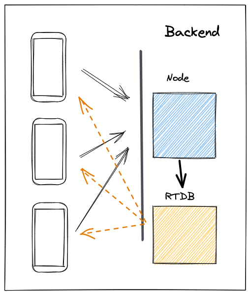

# Desafío

## Table of contents

- [Overview](#overview)
  - [The challenge](#the-challenge)
  - [Screenshot](#screenshot)
- [My process](#my-process)
  - [Built with](#Built-with)
  - [Useful resources](#useful-resources)

## Overview

### The challenge

- For this challenge, we propose you to create a chat based on this [design](https://www.figma.com/file/ntcIT3XtDkjo2UWQc0mmbC/dwf-m6-db-realtime-database?node-id=0%3A1) .

- You have to use the Firebase Realtime Database and follow the backend architecture we saw in the chapter.

### Screenshot

## My process

### Built with

- Firebase Realtime Database
- CSS custom properties
- Flexbox
- Mobile-first workflow

### Useful resources

- [Firebase Docs](https://firebase.google.com/docs/database/security)

- [CORS](https://www.npmjs.com/package/cors)
  - Cross-Origin Resource Sharing (CORS) is a mechanism that uses additional HTTP headers to allow a user agent to obtain permission to access selected resources from a server in a different origin (domain) to which it belongs.
- [Vaadin Router](https://www.npmjs.com/package/@vaadin/router)
  - It uses the widely adopted express.js syntax for routes (/users/:id) to map URLs to Web Component views
- [Body Parser](https://www.npmjs.com/package/body-parser)
  - In order to get the body of a POST request in our application we used the body-parser module as middleware to easily read the body of the request through the req.body. With app.use(bodyparser.json());.
    Although Expess already has it by default, with app.use(express.json());
- [Uuid](https://www.npmjs.com/package/uuid)

  - Universally Unique IDentifier, generates a random identifier.

- [Express](https://www.npmjs.com/package/express)
  - Provides mechanisms for: Writing request handlers with different HTTP verbs in different URL paths (routes).
